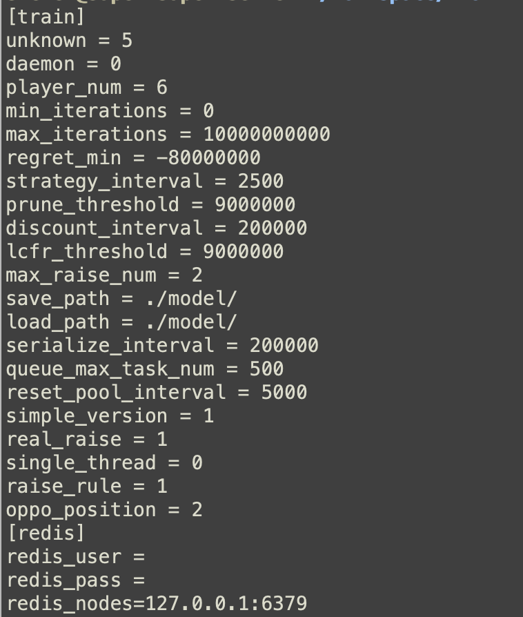

# Multiplayer CFR Poker AI Engine | C++ Self-Play Strategy Research

[简体中文](README.md) | [繁體中文](README.zh-TW.md) | [English](README.en.md) | [Project site](https://masterai-top.github.io/CFR-Poker-AI-Engine-Texas-Holdem/en/)


This repository contains a C++ strategy engine for **multiplayer no-limit Texas Hold'em AI** research. It focuses on Counterfactual Regret Minimization (CFR/MCCFR), multiplayer self-play, information sets, action abstraction, strategy persistence, and low-latency inference evaluation.

> Its distinct search and product position is a multiplayer CFR engine. It is not presented as a heads-up HUNL solver or a complete consumer poker platform. Training-scale and latency figures in project materials require independent reproduction on documented hardware and configurations.

## Engine capabilities

| Component | Scope |
|---|---|
| Multiplayer state | Seats, stacks, betting rounds, community cards, legal actions, and terminal payoff |
| CFR / MCCFR | Regret values, average strategy, self-play iterations, and convergence experiments |
| Abstraction | Fold, check/call and raise actions plus hand and public-state clustering |
| Training runtime | Task scheduling, configurable iterations, serialization, loading, and logs |
| Decision engine | Reads a strategy for the current state and returns an action for inference tests |
| Integration surface | C++ modules, configuration fields, Redis-related settings, and Visual Studio projects |

## Poker decision loop

The engine covers a full decision cycle rather than only calculating equity. It forms information sets from private and public cards, enumerates legal actions, samples from an average strategy, and feeds terminal utility back into regret and strategy updates. Multiplayer play adds position, effective-stack, action-order, and multi-opponent state complexity.

```text
Game state -> information set / abstraction -> legal actions -> CFR policy
          -> fold / call / raise -> terminal utility -> regret + average strategy update
```

## Source layout

- `Pluribus.cpp/.hpp`: multiplayer strategy and search logic
- `State.cpp/.hpp`: game state, transitions, and payoff handling
- `Trainer.cpp/.hpp`: self-play training and iteration control
- `InfoNode.cpp/.hpp`: information-set regret and average strategy
- `GamePool.cpp/.hpp`: parallel game and task pool
- `CardAbst.cpp`, `CardCluster.h`: card and state abstraction
- `TaskExecutor.cpp/.hpp`: training-task scheduling
- `Configure.cpp/.hpp`: runtime, model, and training parameters



## Intended uses

- Multiplayer poker AI and imperfect-information game research
- CFR/MCCFR, self-play, and approximate-equilibrium experiments
- C++ poker-bot strategy-module integration tests
- Comparisons of abstraction, pruning, sampling, and opponent modelling
- Offline replay, benchmarking, and reproducibility studies
- Offline poker analysis software research, not real-time unfair-play assistance

## Verification checklist

Review the license and third-party components, document a reproducible build, and benchmark with recorded hardware, player count, model size, and latency percentiles. Do not use the software to violate local law, platform terms, or fair-play rules.

## Documentation

- [Multiplayer CFR Poker AI Engine](https://masterai-top.github.io/CFR-Poker-AI-Engine-Texas-Holdem/en/)
- [简体中文](https://masterai-top.github.io/CFR-Poker-AI-Engine-Texas-Holdem/zh-cn/)
- [繁體中文](https://masterai-top.github.io/CFR-Poker-AI-Engine-Texas-Holdem/zh-tw/)
